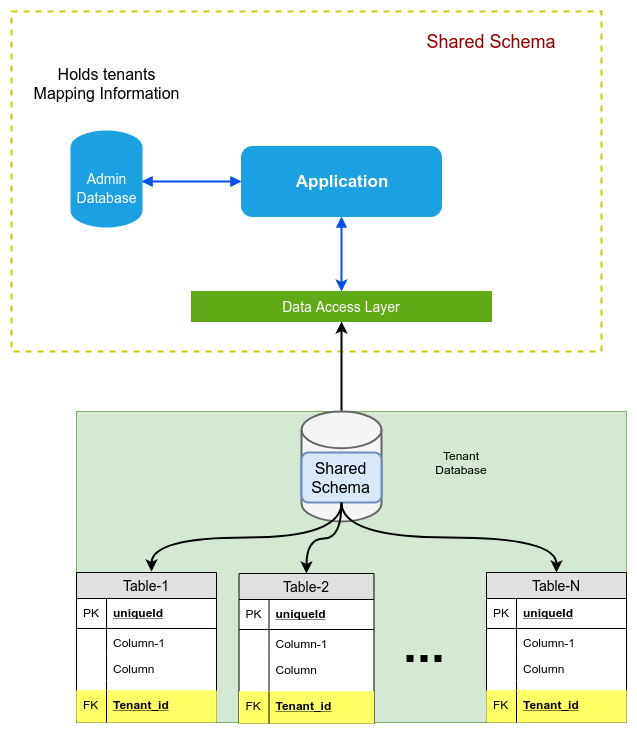
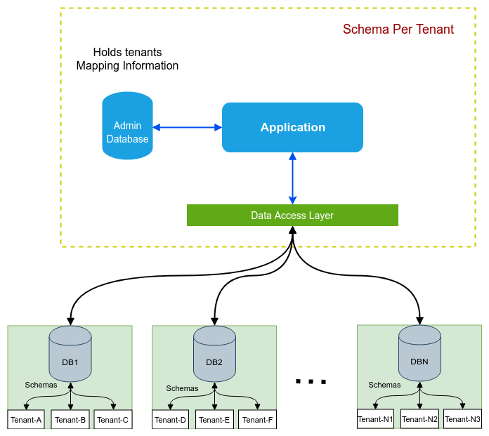
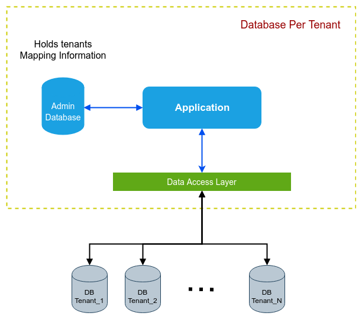

# Multi-tenancy Implementations

Sample Spring Boot applications with Different multi tenancy approaches.

# Multi-tenancy

## What is Multi-tenancy

Multi-tenancy is a software architecture in which a single instance of a software  provides a service for multiple customers or _"tenants."_  A noteworthy example of multi-tenancy software is Software as a Service (SaaS). One server shared by many users, each with its own data.

# why multi-tenancy?
One of the main reasons is multi-tenancy allows us to scale and serve a large number of clients using shared computing resources. Another reason is that tenants are served from the same application stack. This simplifies the overall deployment and operational complexity, and reduces cost associated with operations.

## Different Multi-tenancy implementation – software architecture 
Multi-tenant applications which require tenant data isolation in the database layer. There are different approaches for achieving this data isolation.
The most widely used approaches are

- **Shared schema:** Tenants share common schema and are distinguished by a tenant **discriminator** column.
- **Separate schemas:** Tenants share common database but each tenant has its own set of tables (schema).
- **Separate-databases:** Each tenant has its own database.

### Shared schema:
Shared schema approach is the easiest and most cost-effective. Here, all the tenants share the same database, the same schema and even the same tables. As a result, data records for all the tenants are stored together in these common tables. Each of these common tables have an indexed tenant ID column which is used to retrieve records belonging to a specific tenant.

### Separate schemas:
Separate schema per tenant approach, introduces physical separation between tenants while still using the same database, but creating a new schema for every tenant. All the tables belonging to the tenant then reside within that schema and the data for the tenant is somewhat isolated from other tenant data

### Separate-databases
Each tenant's data is kept in a physically separate database instance. This is the highest level of isolation. It adds further isolation between the tenants by creating a brand new database for every tenant. Each of these databases have the same schema and migrations are run on all the tenant databases during deployment.

# Multi-tenancy in Hibernate
Hibernate officially supports two different multi-tenancy mechanisms:

- **separate schema:** every tenant has its own schema in a shared database
- **separate database:** every tenant has its own database instance

Unfortunately, both of these mechanisms come with some downsides in terms of scaling. A third Hibernate multi-tenancy mechanism, a tenant discriminator, also exists, and it’s usable—but it’s still considered a work-in-progress by some.

There is a open issue [HHH-6054](https://hibernate.atlassian.net/browse/HHH-6054) to Support for discriminator-based multi-tenancy in hibernate.

Hibernate provides filters which allow for parameterized data to be used in a conditional to determine if queried data should be returned or not. With this we can implement discriminator-based multi-tenant application.
